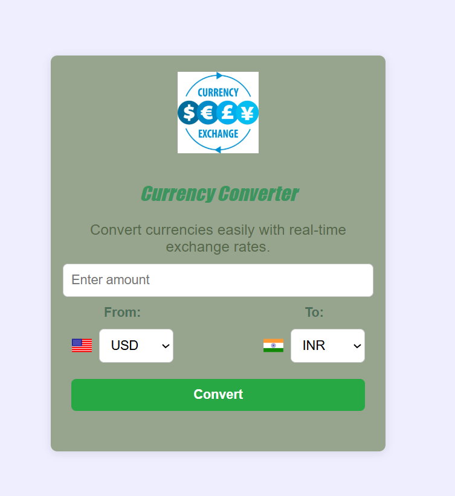

# 🌍 Currency Converter

A simple currency converter web application built with **HTML**, **CSS**, and **JavaScript**.  
It uses an external API to fetch live exchange rates and allows users to convert currencies easily.

---

## ✨ Features
- Select two countries/currencies to convert between.
- Enter the amount you want to convert.
- Get the converted currency displayed instantly.
- Clean and simple user interface.

---

## 🛠️ Technologies Used
- **HTML** – structure of the app  
- **CSS** – styling for a better user experience  
- **JavaScript** – functionality and API integration  
- **Currency Exchange API** – to fetch live conversion rates  

---

## 🚀 How to Use
1. Clone or download this repository.
2. Open the project folder.
3. Add your API key inside the JavaScript file (replace `YOUR_API_KEY_HERE`).
4. Open `index.html` in your browser.
5. Select the currencies you want to convert.
6. Enter the amount and see the converted value displayed below.

---

## 📷 Demo
**
---

## 📌 Example
- Select **USD** → **INR**
- Enter amount: `10`
- Result: `10 USD = 830 INR` (depending on the live exchange rate)

---

## 📄 Note
- You will need a free API key from a currency exchange provider (e.g., [ExchangeRate API](https://www.exchangerate-api.com/) or [CurrencyAPI](https://currencyapi.com/)).
- Make sure to replace the placeholder API key with your own.

---

## 📜 License
This project is open-source and free to use.
